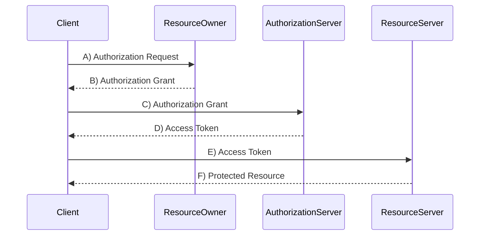

# Cheatsheet

### Redis

- **Write-through**: Data is written to the cache and the underlying database simultaneously.
- **Lazy Loading**: Cache only stores data when it is requested, reducing the load on the cache.
- **Cache Invalidation**: The process of removing or updating data in the cache when the underlying data changes.

#### 1. Write-through Cache

`write-through` means that data is written to the cache and the database at the same time.

- when a new item is added
- when an item is updated
- when an item is deleted

```js
function writeThroughCache(key, value) {
  // write to the cache with a TTL
  redisClient.set(key, value, "EX", 3600); // 1 hour: 60 * 60

  // write to the database
  dbClient.set(key, value);
}
```

#### 2. Lazy Loading Cache

Data is loaded only when it is needed. This can help reduce the load on the cache.

- when an item is requested, check if it is in the cache
- if it is not in the cache, load it from the database and store it in the cache
- if it is in the cache, return it from the cache

```js
function lazyLoadingCache(key) {
  // check if the item is in the cache
  const value = redisClient.get(key);

  if (value) {
    // return the item from the cache
    return value;
  } else {
    // load the item from the database
    const value = dbClient.get(key);

    // store the item in the cache with a TTL
    redisClient.set(key, value, "EX", 3600); // 1 hour: 60 * 60

    // return the item
    return value;
  }
}
```

#### 3. Cache Invalidation

When data in the database changes, the cache needs to be updated to reflect those changes.

- when an item is updated or deleted, remove it from the cache
- when a new item is added, add it to the cache
- when the cache is full, remove the least recently used item
- when the time-to-live (TTL) expires, remove the item from the cache

```js
if (item is updated or deleted or TTL expires) {
  // remove the item from the cache
  redisClient.del(key);
} else if (new item is added) {
  // add the item to the cache with a TTL
  redisClient.set(key, value, "EX", 3600); // 1 hour: 60 * 60
} else if (cache is full) {
  // remove the least recently used item from the cache
  redisClient.lpop();
}
```

### Websockets

- **Pros of WebSockets**:
  - Low latency, real-time communication.
  - Persistent connection between client and server.
- **Cons of WebSockets**:
  - More complex to implement than HTTP polling.
  - May be blocked by proxies or firewalls.
- **Polling**:
  - Easier to implement.
  - Can be resource-intensive and cause server load due to frequent requests.

|               | **WebSockets**                                              | **Polling**                        |
| ------------- | ----------------------------------------------------------- | ---------------------------------- |
| **Pros**      | Low latency, real-time communication, persistent connection | Easier to implement                |
| **Cons**      | More complex, may be blocked by firewalls                   | Resource-intensive, server load    |
| **Use Cases** | Real-time applications, games, collaborative tools          | Polling for updates, notifications |

### React

- **State** is used for internal component data, while **Props** is used to pass data and functions between components.
- **Hoisting** allows sharing state between sibling components by lifting it to the parent component.
- React's **Lifecycle** has three main phases: `Trigger`, `Render`, and `Commit`.

#### 1. State vs. Props

- **State**:
  - Managed within the component (internal).
  - Mutable: Can be changed with `setState` or `useState` in functional components.
  - Used for dynamic data that affects the component's rendering.
  - Example:
    ```jsx
    const [count, setCount] = useState(0);
    ```
- **Props**:
  - Passed from parent to child component (external).
  - Immutable: Cannot be changed by the receiving component.
  - Used to pass data and event handlers down the component tree.
  - Example:
    ```jsx
    function ChildComponent({ name }) {
      return <div>{name}</div>;
    }
    ```

#### 2. Hoisting State

- **Concept**: Hoisting refers to lifting the shared state up to the nearest common ancestor to share data between sibling components.
- **Example**:

  - If two sibling components need to access and modify the same piece of data, lift the state up to their parent component and pass it down via props.

  ```jsx
  function ParentComponent() {
    const [sharedData, setSharedData] = useState("Initial Data");

    return (
      <div>
        <ChildOne data={sharedData} setData={setSharedData} />
        <ChildTwo data={sharedData} />
      </div>
    );
  }
  ```

#### 3. Component Lifecycle

- **Triggering** a render (delivering the guest’s order to the kitchen)
  - When it is the initial render.
  - When the state updates.
- **Rendering** the component (preparing the order in the kitchen)
  - On initial render, React will call the root component.
  - For subsequent renders, React will call the function component whose state update triggered the re-render.
- **Committing** to the DOM (placing the order on the table)
  - For the initial render, React will use the `appendChild()` to put all the DOM nodes on the page.
  - For subsequent renders, React will apply the minimal necessary operations to update the DOM.

### Authentication

- **OAuth2 Flow**: Authorization Code Flow (user authorization, exchange code for token).
- **Session Management**: Sessions can be managed via cookies or tokens (e.g., JWT).
- **OAuth vs OIDC**:
  - **OAuth**: Primarily for authorization.
  - **OIDC (OpenID Connect)**: Layer on top of OAuth2 for authentication.
  - OIDC helps manage user sessions securely.

#### 1. OAuth2 Flow



- Authorization Request:
  - The client requests authorization from the resource owner to access the resource.
- Authorization Grant:
  - The resource owner grants authorization to the client.
- Access Token:
  - The client sends the authorization grant to the authorization server in exchange for an access token.
- Protected Resource:
  - The client uses the access token to access the protected resource.

#### 2. Session Management

**Why Use Sessions?**

- **Stateful**: Sessions allow the server to maintain state for each user.
- **Security**: Sessions can be used to store sensitive information securely.
- **Performance**: Sessions can improve performance by reducing database queries.

**How sessions are managed?**

> **Cookies**: Store session data in cookies.

- Client requests /foo
- Server receives request, checks for session cookie
  - If no session cookie, create a new session
  - Gives HTML response with session cookie: `Set Cookie: session=123`
- Client receives response with session cookie
- Further requests will include the session cookie
- If in a new icognito tab, no session cookie is sent, then a new session is created

> **express-session**: Middleware for managing sessions in Express.

```js
import session from "express-session";

// Setup session middleware
app.use(
  session({
    secret: "my-secret",
    cookie: { maxAge: 60000 },
    resave: false,
    saveUninitialized: false,
  })
);

// Access session data
app.get("/foo", (req, res, next) => {
  if (req.session.views) {
    req.session.views++;
    res.setHeader("Content-Type", "text/html");
    res.write("<p>views: " + req.session.views + "</p>");
    res.write("<p>expires in: " + req.session.cookie.maxAge / 1000 + "s</p>");
    res.end();
  } else {
    req.session.views = 1;
    res.end("welcome to the session demo. refresh!");
  }
});
```

#### 3. Relationships

- **OAuth2 and OIDC**:
  - **OAuth2**: Authorization protocol that allows third-party applications to obtain limited access to a web service.
  - **OIDC**: Builds on top of OAuth2 to provide an identity layer, allowing clients to verify the identity of the end-user based on the authentication performed by an authorization server. OIDC extends OAuth2 by adding user authentication and session management.
- **Session Management**:
  - After users log in via OAuth2/OIDC, the server creates a session to keep the user logged in, storing seeion data in cookies or tokens.
  - With OIDC, the ID token includes user information, which can be used to create and manage sessions.
- **In Summary**:
  - OAuth2 provides the framework for authorization, OIDC extends it to manage user authentication, and session management keeps users logged in.

### GraphQL

- **Motivation over REST**: Fetches only required data, reducing over-fetching and under-fetching.
- **GraphQL Schema**: Defines types, queries, and mutations.
- **Queries**: Fetch data.
- **Mutations**: Modify data.
- **Apollo Client Setup**: Used to interact with GraphQL API from the client-side.

### AWS/Docker

- **Containers vs VMs**:
  - **Containers**: Lightweight, share the host OS kernel, faster startup.
  - **VMs**: Full OS, more isolated, higher resource usage.
- **EC2 vs Physical VM**:
  - **EC2**: Scalable, managed by AWS, pay-as-you-go.
  - **Physical VM**: Requires hardware, self-managed.
- **Image vs Container**:
  - **Image**: Blueprint for containers, immutable.
  - **Container**: Running instance of an image.
- **EC2 + Docker**: Deploy a Dockerized website on EC2 instances for scalability and ease of management.

### Security

- **Form Validation**: Prevents invalid data from being processed.
- **XSS (Cross-Site Scripting)**: Attacker injects malicious scripts. Mitigation: Escape user input.
- **CSRF (Cross-Site Request Forgery)**: Malicious requests sent from a trusted user's browser. Mitigation: Use anti-CSRF tokens.
- **SQL Injection**: Injecting malicious SQL queries. Mitigation: Use parameterized queries.
- **RBAC/ABAC**: Role-Based Access Control vs. Attribute-Based Access Control. Used for fine-grained access control.

#### Attack examples

- **Invalid Input**: In a form field, the attacker enters a script that is executed when the form is submitted, or a SQL injection that deletes the database.
- **XSS**: The attacker injects a script that can be executed in the user's browser, stealing cookies or session data.
- **CSRF**: The attacker tricks the user into submitting a request that the user did not intend to make, e.g., fake form submission by hiding it or auto-submitting it.
- **SQL Injection**: The attacker injects SQL queries into input fields, manipulating the database or retrieving sensitive data.
