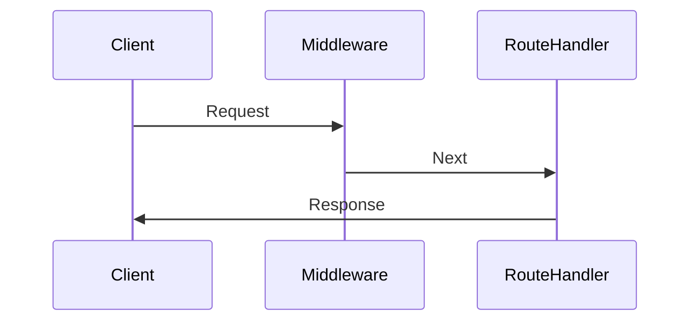

# Middleware in Next.js

Middleware is a function that runs before the main function. In Next.js, middleware is used to execute code before the request is processed by the route handler.

- by default, middleware runs before every route in a project, but we can specify which paths using a matcher.
- **Analogy**: chunk of code that is in every page.
- Only one middleware function can be used at a time.
- Middleware needs to produce a response:
  - one way is to call `next()`
  - another way is to return a response directly.
